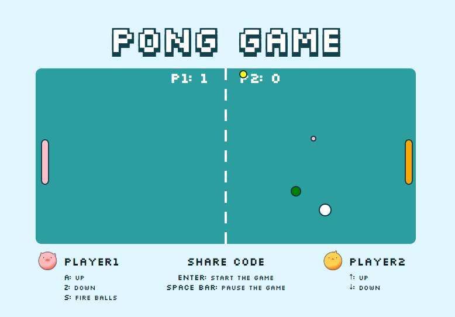

# Pong Game

A basic pong game using SVGs.

## Setup

**Install:**

`> npm i`

**Run:**

`> npm start`

## Keys

**Player 1:**
* a: up
* z: down
* s: fire shot

**Player 2:**
* ▲ : up
* ▼: down

**Share code:**
* enter: start game/ re-start game
* space bar: pause the game

##How to Play
The game features two paddles, a ball and balls, the goal is to 
defeat your opponent by being the first one to gain 10 
point, a player gets a point once the opponent misses a ball. 
The game can be played with two human players, or one player 
against a computer controlled paddle.

##Stretch Goal Note
- Make it prettier.
- Trigger multiple balls.
- Create balls with special effects (different speeds, sizes and color).
- Trigger speed changes or size changes of paddles.
- Fire a shot from a paddle on 's' key press.
- Declare a winner at a final score.

##what I have learned
- learn how to render SVGs by using Javascript and HTML
- learn ES2015 class constructor and methods
